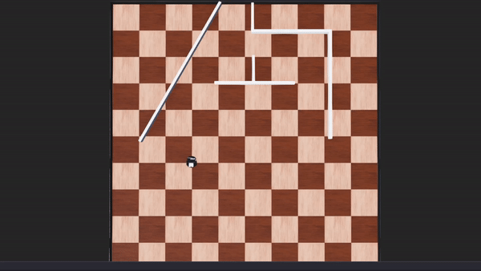
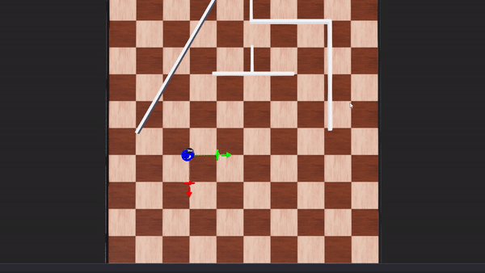
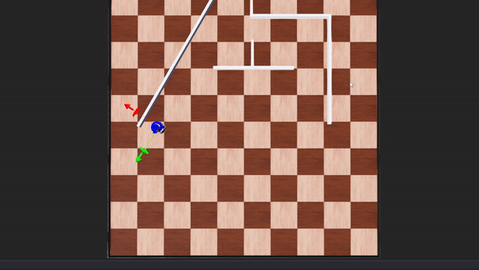

# Mobile robotics using webots simulator\
  Differential Drive : Drive to goal using two steps\
  [Click for the controller code](module2_assignment/controllers/diff_drive/diff_drive.py)\
\
  Find the closest wall\
   [Click for the controller code](module2_assignment/controllers/closest_point/closest_point.py)\
\
  Follow the wall\
   [Click for the controller code](module2_assignment/controllers/wall_following/wall_following.py) \

